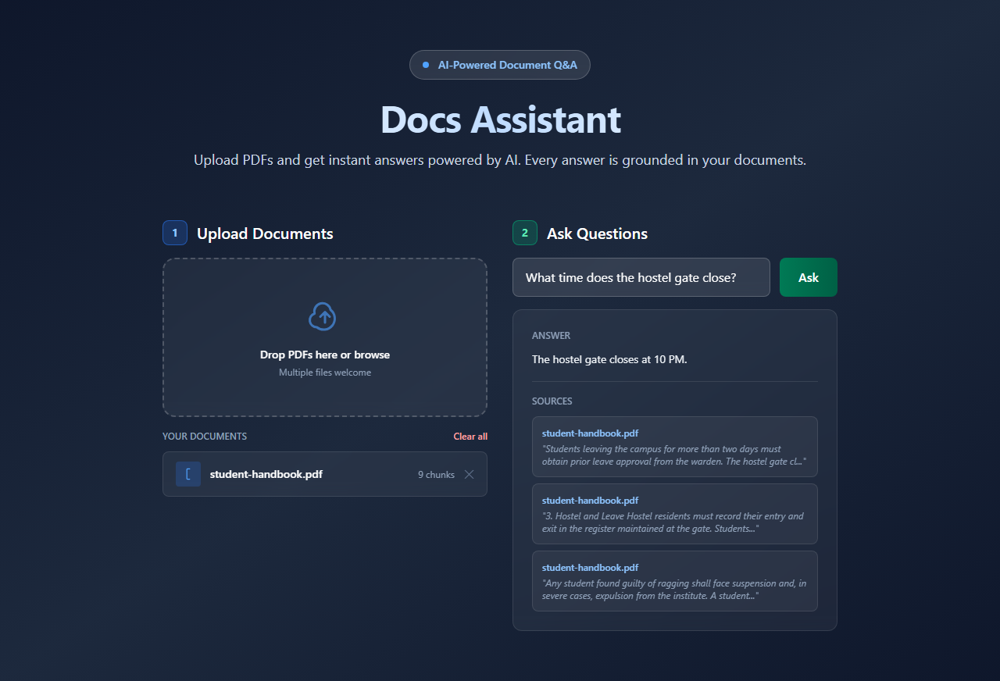
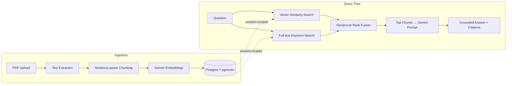
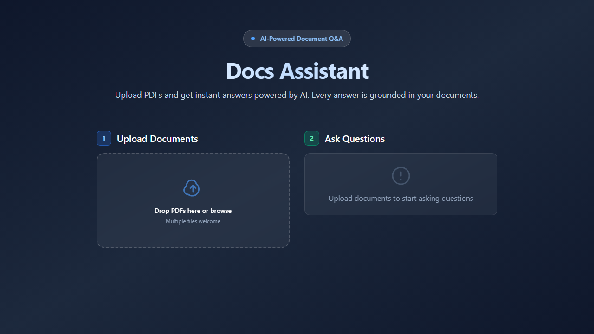

<div align="center">

# 📚 Docs Assistant

### Upload any PDF. Ask it anything. Get answers it can actually prove.

A retrieval-augmented generation (RAG) app with **hybrid search** (vector + keyword,
fused with Reciprocal Rank Fusion), **session-scoped document management**, and
answers that are grounded in your documents only — no hallucinated citations, no
made-up facts. If it's not in the doc, it says so.

[](https://docs-rag-assistant.vercel.app)

[](https://github.com/dhanubansal777/docs-rag-assistant/actions/workflows/ci.yml)
[](LICENSE)


</div>

<br>

<div align="center">
  
</div>

<br>

## ✨ Why this isn't just another "PDF chatbot"

Most weekend RAG projects stuff a PDF into a vector store and call it done. This one
solves the problems that actually show up once you use it for real:

| Problem | How it's solved here |
|---|---|
| 🎯 **Vector search alone misses exact keyword matches** | Hybrid search — cosine similarity **and** Postgres full-text search, merged with **Reciprocal Rank Fusion** — see [`retrieval.js`](backend/retrieval.js) |
| 🤥 **LLMs confidently hallucinate when the answer isn't there** | The prompt forces answers from retrieved context only, with a hard-coded refusal string when the context doesn't contain the answer |
| 🗂️ **Multi-user apps leak documents across sessions** | Every upload/query is scoped to a browser-generated `sessionId` at the database level |
| 🔁 **Re-uploading a file quietly duplicates its chunks** | Ingestion deletes a file's previous chunks before re-inserting — idempotent by filename |
| 🕵️ **"What's actually in my knowledge base?" is invisible** | `GET /api/documents` makes the server the single source of truth — the UI reflects real DB state, not stale client memory |
| 📊 **"Does retrieval even work?" is usually just vibes** | A real [eval harness](backend/evaluate.js) measures retrieval hit-rate and refusal-rate against a labeled question set |

<br>

## 🧠 How it works



<br>

## 🚀 Live Demo

| | |
|---|---|
| **Frontend** | [docs-rag-assistant.vercel.app](https://docs-rag-assistant.vercel.app) |
| **Backend API** | [docs-rag-assistant.onrender.com](https://docs-rag-assistant.onrender.com/health) |

> ⏳ The backend is on Render's free tier, which spins down after 15 minutes idle.
> The first request after a quiet period can take 30–60s to wake up — that's the
> platform, not the app.

<br>

## 🛠️ Tech stack

<table>
<tr>
<td valign="top" width="50%">

**Frontend**
- React 19 + Vite
- Tailwind CSS

**LLM**
- Google Gemini `2.5-flash` (answers)
- Google Gemini `embedding-001` (768-dim vectors)

</td>
<td valign="top" width="50%">

**Backend**
- Node.js + Express 5
- Multer (uploads) + `pdf-parse`

**Database**
- PostgreSQL + [pgvector](https://github.com/pgvector/pgvector)
- Hybrid search: `ivfflat` cosine index + `tsvector`/GIN full-text index

</td>
</tr>
</table>

**Tooling**: Vitest (unit tests) · GitHub Actions (CI) · deployed on Vercel + Render + Neon

<br>

## 📸 Screenshots

<table>
<tr>
<td width="50%">

**Grounded answer with citations**


</td>
<td width="50%">

**Clean, document-driven empty state**


</td>
</tr>
</table>

<br>

## ⚡ Getting started

### Prerequisites

- Node.js 20+
- A PostgreSQL database with the `pgvector` extension (e.g. [Neon](https://neon.tech), free tier)
- A [Google Gemini API key](https://ai.google.dev/)

### 1. Backend

```bash
cd backend
npm install
cp .env.example .env      # fill in GEMINI_API_KEY and DATABASE_URL
psql "$DATABASE_URL" -f db/schema.sql
npm run dev                # → http://localhost:5000
```

Optional — seed with the sample docs in `backend/docs/`:

```bash
node ingest.js
```

### 2. Frontend

```bash
cd frontend
npm install
cp .env.example .env      # set VITE_API_URL if not using localhost:5000
npm run dev                # → http://localhost:5173
```

### 3. Tests

```bash
cd backend
npm test
```

<br>

## 🔌 API reference

| Endpoint | Method | Body / Query | Description |
|---|---|---|---|
| `/api/upload` | `POST` | `multipart/form-data`: `files[]`, `sessionId` | Ingest PDFs (≤10MB each, 5/request). Re-uploading a filename replaces its old chunks. |
| `/api/ask` | `POST` | `{ question, sessionId }` | Ask a question over the session's documents |
| `/api/documents` | `GET` | `?sessionId=` | List documents stored for a session |
| `/api/documents` | `DELETE` | `?sessionId=&source=` | Remove one document |
| `/api/session` | `DELETE` | `?sessionId=` | Wipe every document in a session |
| `/health` | `GET` | — | Health check |

All `/api/*` routes are rate-limited to 20 requests/minute per IP.

<br>

## 📁 Project structure

```
docs-rag-assistant/
├── backend/
│   ├── server.js          # Express app + routes
│   ├── rag.js              # Prompt construction + Gemini call + caching
│   ├── retrieval.js        # Hybrid search: vector + keyword + RRF
│   ├── upload-ingest.js    # PDF → chunks → embeddings → Postgres
│   ├── documents.js        # List / delete / clear session documents
│   ├── chunkText.js        # Sentence-aware chunking (shared, unit-tested)
│   ├── evaluate.js          # Retrieval hit-rate + refusal-rate eval harness
│   └── db/schema.sql        # pgvector + full-text schema
└── frontend/
    └── src/App.jsx          # Upload UI + Q&A UI
```

<br>

## 🗺️ Roadmap

- [ ] Streaming answers (SSE) instead of a single blocking response
- [ ] Non-PDF document support (`.docx`, `.txt`)
- [ ] Auth so sessions survive across devices, not just `localStorage`

<br>

## 📄 License

MIT — see [LICENSE](LICENSE).
